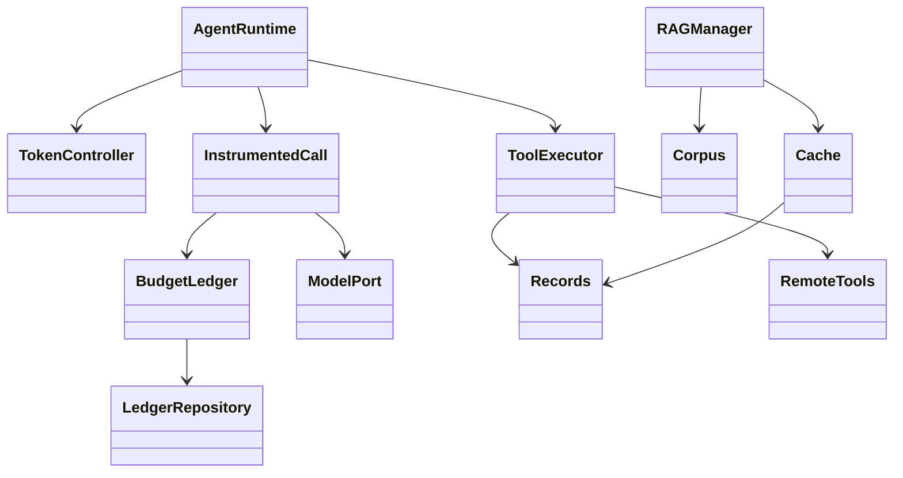
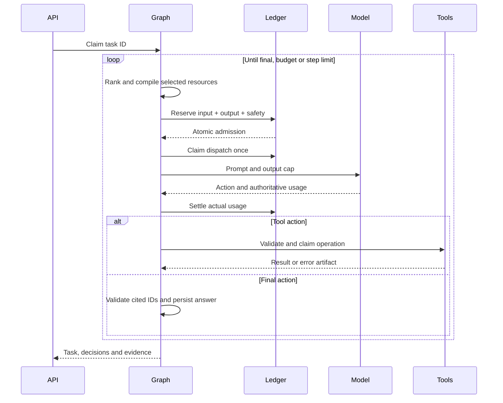

# Architecture
## Problem and decisions
Static prompts spend context on irrelevant material and repeat tool schemas/results across calls. TokenOS compiles each prompt under a task-wide ledger. Selection uses deterministic score/cost heuristics, permitting measurable ablations without training. Generation capacity is reserved before admitting a model call; workflow complexity is limited by routing and maximum steps rather than pretending control flow itself consumes tokens.

Repositories isolate storage. ModelPort, Records, Corpus and RemoteTools are injectable boundaries. Domain values use frozen Pydantic v2 models; infrastructure implements async protocols. The API lifespan is the composition root. The initial ledger uses a separate repository transaction interface so concurrent workers cannot oversubscribe a run.

## Folders
| Path | Responsibility |
|---|---|
| src/tokenos/domain | Immutable values, usage, reservations, errors |
| src/tokenos/application | Ledger service, model invocation, repository interfaces |
| src/tokenos/runtime/contracts.py | Task, policy, candidate and tool contracts |
| src/tokenos/runtime/managers.py | Pure allocation and context policies; cache/RAG services |
| src/tokenos/runtime/engine.py | LangGraph application orchestration |
| src/tokenos/runtime/storage.py | Memory/PostgreSQL runtime repositories |
| src/tokenos/runtime/providers.py | Sandbox and Gemini adapters |
| src/tokenos/runtime/tools.py | MCP and tool execution |
| src/tokenos/infrastructure | Ledger repositories, LangChain adapter, configuration, telemetry |
| src/tokenos/interfaces | FastAPI composition root and ledger endpoints |
| dashboard, config, migrations | UI, policy/fixtures, SQL |
| tests, benchmarks, scripts | Verification, datasets/results, operational CLIs |

## Class relationships

## Sequence

## Database schema
SQL is authoritative in migrations/001_ledger.sql and 002_runtime.sql.
| Table | Keys and content | Purpose |
|---|---|---|
| tokenos_runs | run UUID, spec/snapshot JSONB, BIGINT counters | Budget counters and run spec |
| tokenos_reservations | run/reservation IDs, state, snapshot JSONB | Exactly-once dispatch and settlement state |
| tokenos_events | event UUID, run/version, JSON payload | Append-only ledger audit |
| tokenos_records | namespace + key, body JSONB, updated_at | Tasks, artifacts, tool registry, operations, cache, benchmarks |
| tokenos_documents | document ID, body JSONB, revision | Source provenance and corpus changes |
| tokenos_chunks | chunk ID, document FK, body JSONB, embedding vector(256) | Exact cosine retrieval |
| tokenos_schema_migrations | name, checksum | Ordered migration integrity |

## APIs
All endpoints, including health, require X-API-Key. OpenAPI interactive docs are available at /docs.
| Method | Route | Function |
|---|---|---|
| GET | /health | Liveness |
| GET | /v1/runtime | Provider and policy |
| POST / GET | /v1/tasks | Execute task / list recent tasks |
| GET | /v1/tasks/{id} | Task plus ledger |
| GET | /v1/tasks/{id}/artifacts/{key} | Task-scoped raw artifact |
| POST / GET | /v1/documents | Upsert source / list sources |
| GET | /v1/tools | Advertised schema registry |
| POST | /v1/mcp/{server}/discover | Discover configured server tools |
| GET | /v1/benchmarks | Stored reports |
| POST / GET | /v1/runs and /v1/runs/{id} | Create/read ledger run |
| POST | /v1/runs/{id}/reservations | Reserve capacity |
| POST | /v1/runs/{id}/reservations/{rid}/{operation} | dispatch, settle, unknown or release |
| GET | /v1/runs/{id}/events | Version-cursor audit events |
| POST | /v1/runs/{id}/baseline | Original injected LangChain/simulation adapter |

## Implementation order
1. Validate policy and task contracts.
2. Initialize repositories and ledger.
3. Seed local fixture registry/corpus if absent.
4. Rank candidates and reserve output capacity.
5. Compile resources with framing costs and admit invocation.
6. Settle usage before parsing the action, including malformed answers.
7. Validate tool schemas, persist dispatch claim, retain raw results.
8. Reallocate using step/error state, or persist terminal task.
9. Compare policies with independently verified fixture outcomes.
