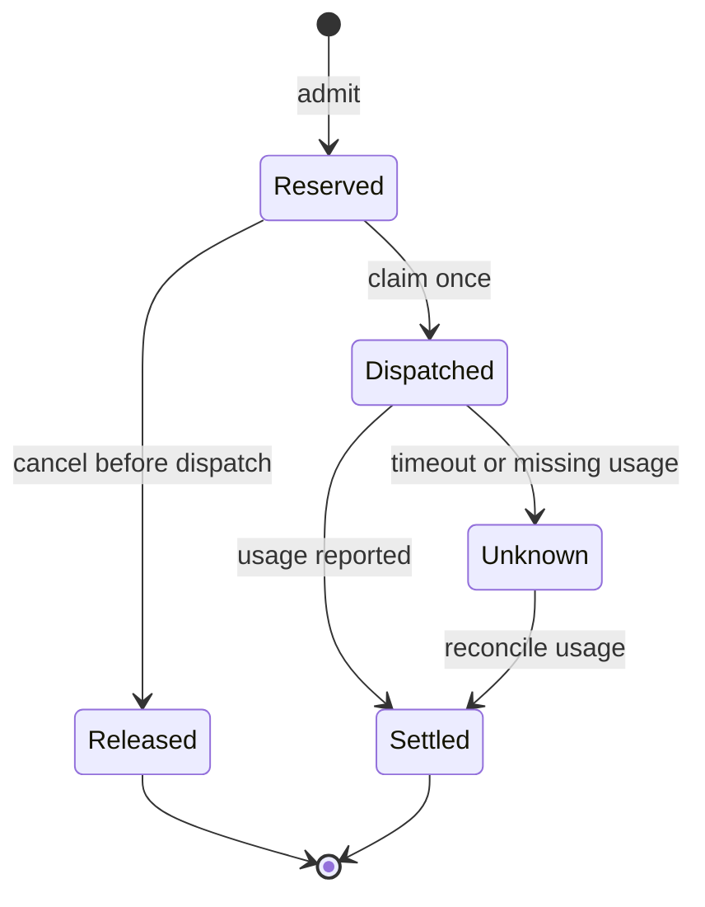
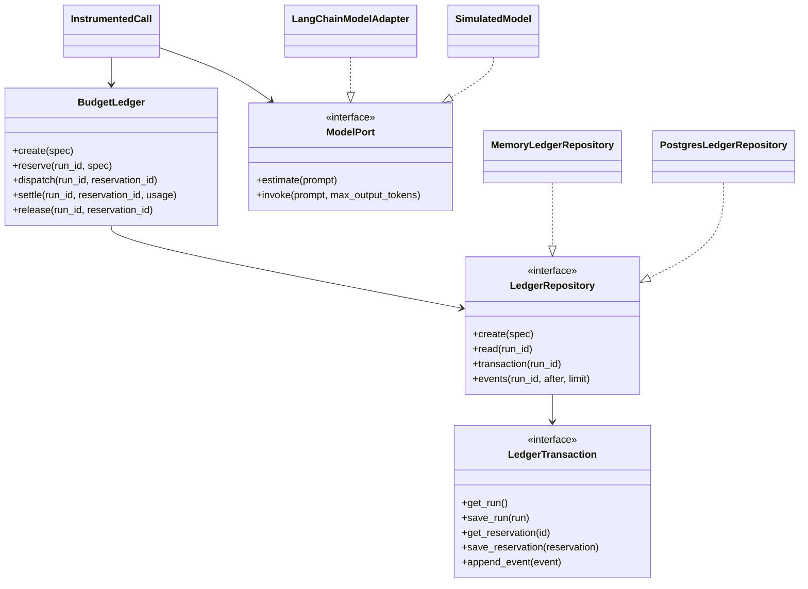
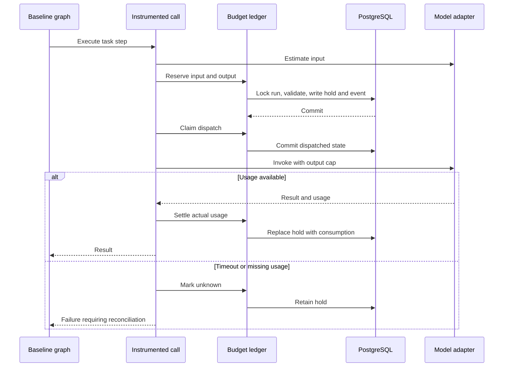

# Module 01 architecture and implementation

## Problem statement

An agent may reuse context and invoke models many times. A prompt-length limit alone does not bound task-wide usage. Parallel steps can oversubscribe remaining quota; duplicated callbacks can double-charge; timeouts can hide already-consumed tokens. Without an auditable ledger, any claimed token reduction is difficult to trust.

This module admits model attempts against finite task budgets, tracks the lifecycle of each attempt, and reconciles reservations with actual provider usage. It provides the accounting substrate for future adaptive allocation.

## Design decisions

| Decision | Reason and tradeoff |
|---|---|
| Modular monolith | One deployable API with replaceable adapters is feasible in four months. No distributed-service overhead yet. |
| Pure validated domain values | Pydantic v2 provides boundary validation; domain types do not import FastAPI, LangGraph or asyncpg. |
| Async application service | `BudgetLedger` implements use cases against repository protocols. Model I/O uses a separate port. |
| Repository plus transaction port | A service transition updates state and appends its event in one transaction. |
| PostgreSQL row lock per run | Serializes competing workers for the same budget while different runs remain independent. |
| Short transactions | Model/network execution happens after dispatch commits; no row lock spans a provider request. |
| Composite reservation key | `(run_id, reservation_id)` is the attempt identity; retrying an operation is distinct from retrying a model. |
| Persistent ledger, simple graph | The baseline is one instrumented LangGraph node. The ledger survives DB-backed restarts; the graph itself is not checkpointed yet. |
| Configuration and optional pricing | A fixed rate snapshot makes cost reproducible; no supplied rate means unknown cost. |
| Immutable event API | The app appends events and exposes cursor reads. DB administrators can still edit data; this is not a tamper-proof audit system. |

SOLID application: separate execution, accounting, persistence and HTTP responsibilities; add providers/repositories through protocols; run adapter contract tests; expose small interfaces; inject concrete dependencies only in the composition root. There is no abstract base class for every value or unnecessary generic repository.

## Accounting model

For a reservation:

`hold = estimated_input_components + safety_margin + maximum_output`

Before admission:

`spent + held + new_hold <= task_budget`

and:

`estimated_input + safety_margin + maximum_output <= context_window`

This conservative context check assumes an adapter whose input and maximum output share the declared context capacity. Provider-specific limits may require stricter preflight checks.

Settlement removes the original hold and adds actual `input_tokens + output_tokens`. Cached input is a subset of input; reasoning is a subset of output. Neither is added again. Repeated context counts on every model call, including cached context as logical tokens.

Component estimates are disjoint: system, memory, RAG, tool schemas, tool results, trajectory, user and framing overhead. The baseline currently fills only user and overhead. Component estimates are not represented as exact provider billing allocations. Providers usually report request totals rather than per-component token attribution.

**Workflow complexity is not an extra token bucket.** Each planner, verifier or additional agent call makes another reservation with a `purpose`. Future controller decisions reserve budgets across calls; they must not add workflow tokens to already-counted call usage.

## State machine

No automatic timeout release: timeout is not proof that the provider did no work. A dispatch committed immediately before process death remains held. A crash between dispatch and actual network send is deliberately indistinguishable from a sent request until investigated.

Dispatch is at-most-once authorization **per reservation**, not exactly-once provider execution. The runtime must not create a new reservation to blindly retry an unresolved attempt. SDK retries must be disabled or separately accounted for.

If actual usage exceeds estimates, it is still stored. If spent plus outstanding holds exceeds the task budget, `breached=true` becomes sticky; new reservations and new dispatches are blocked. Outstanding calls may still finish and must be settled. Recorded historical consumption cannot be undone.

## Folder structure

| Location | Responsibility |
|---|---|
| `src/tokenos/domain/models.py` | Typed quantities, usage, run/reservation state, errors and events |
| `src/tokenos/application/ports.py` | Repository/transaction abstractions |
| `src/tokenos/application/ledger.py` | Budget lifecycle and atomic transitions |
| `src/tokenos/application/execution.py` | Model port and instrumented execution |
| `src/tokenos/application/evaluation.py` | Correct aggregate TPS and accounting completeness |
| `src/tokenos/infrastructure/memory.py` | Single-process transactional test/dev repository |
| `src/tokenos/infrastructure/postgres.py` | Async PostgreSQL repository and row locks |
| `src/tokenos/infrastructure/models.py` | Simulator and injectable LangChain adapter |
| `src/tokenos/infrastructure/graph.py` | Compiled async LangGraph baseline |
| `src/tokenos/infrastructure/settings.py` | Environment-driven configuration |
| `src/tokenos/infrastructure/telemetry.py` | JSON logs and OpenTelemetry setup |
| `src/tokenos/interfaces/api.py` | HTTP transport, dependencies and composition root |
| `migrations/001_ledger.sql` | Tables, indexes and constraints |
| `tests/unit`, `tests/integration` | Domain behavior and real boundary tests |
| `scripts` | Environment initialization, demo, migration and microbenchmark |
| `.github/workflows/ci.yml` | Python checks, PostgreSQL tests and container build |

## Class diagram

## Database schema

The actual DDL is in `migrations/001_ledger.sql`.

| Table | Key and columns | Purpose |
|---|---|---|
| `tokenos_runs` | PK `run_id`; `spec JSONB`; `budget_tokens`, `spent_tokens`, `reserved_tokens`, `version BIGINT`; `snapshot JSONB`; timestamps | Lock target, immutable run configuration and current totals |
| `tokenos_reservations` | PK `(run_id, reservation_id)`; FK run; `state TEXT`; `snapshot JSONB`; `updated_at` | Idempotency record, request digest, reservation components and normalized settled usage |
| `tokenos_events` | PK `event_id`; FK run and optional reservation; unique `(run_id, version)`; kind, timestamp, JSONB event envelope | Ordered history and cursor-based inspection |

Run snapshots include cumulative input/output/cached/reasoning counts, optional Decimal cost and breach status. Reservation snapshots include the immutable spec and settled usage. Relational counters and snapshots are updated together by the repository; writes outside that adapter can break consistency. The JSON snapshots keep this first module compact while retaining indexed relational admission data. Future analytics can materialize typed usage-event columns.

The run primary key supports admission lookup; reservation primary key supports idempotency; event `(run_id,version)` supports pagination; a partial timestamp index supports inspecting unresolved calls. Raw prompts and model outputs are not persisted by this module. Request digests detect payload changes but are not a privacy guarantee for guessable text.

## API endpoints

All application endpoints require `X-API-Key`. This is a trusted single-tenant runtime API; callers with this credential can set quotas and report usage. It must not be exposed as a customer-controlled billing service.

| Method | Endpoint | Behavior |
|---|---|---|
| GET | `/health` | Authenticated process liveness, not a database-readiness probe |
| POST | `/v1/runs` | Create run using a client UUID; same payload is idempotent |
| GET | `/v1/runs/{run_id}` | Current totals, held and available budget |
| POST | `/v1/runs/{run_id}/reservations` | Reserve estimated input plus maximum output and margin |
| POST | `/v1/runs/{run_id}/reservations/{id}/dispatch` | Claim exactly one authorization to invoke |
| POST | `/v1/runs/{run_id}/reservations/{id}/settle` | Record actual normalized usage, including overruns |
| POST | `/v1/runs/{run_id}/reservations/{id}/unknown` | Retain hold while usage remains unresolved |
| POST | `/v1/runs/{run_id}/reservations/{id}/release` | Release only before dispatch |
| GET | `/v1/runs/{run_id}/events` | Ordered events; `after_version=-1`, `limit=100`, max 200 |
| POST | `/v1/runs/{run_id}/baseline` | Invoke configured model through the graph and ledger |

Errors: 401 invalid credential; 404 missing resource; 409 conflicting/replayed dispatch or lifecycle violation; 422 invalid parameters or insufficient budget; 502 missing/unsupported provider usage; 503 unexpected dependency failure. Retrying a 503 requires inspecting ledger state first. Replayed creates/reserves return the same response status as the original operation.

The generated `docs/openapi.json` is the full request/response contract.

## Sequence diagram

## Implementation steps

1. Define immutable token, usage and reservation values and explicit lifecycle errors.
2. Define transaction/repository/model ports; keep provider calls outside ledger transactions.
3. Implement admission, claim, settlement, release and event ordering.
4. Implement memory rollback semantics and PostgreSQL row-lock transactions.
5. Compile the baseline graph around `InstrumentedCall`.
6. Wire lifespan-managed dependencies into FastAPI; validate settings and service credentials.
7. Add simulator tests, usage normalizer tests, HTTP tests and database contracts.
8. Package locked dependencies, migrations, Docker and CI; record actual validation outcomes.

These steps are implemented in the source, not pseudocode placeholders. The remaining deployment/provider validation is explicitly listed in `validation.md`.

## Edge cases and behavior

| Case | Defined result |
|---|---|
| Concurrent calls exceed shared quota | Only admissible reservations commit; others get budget rejection |
| Same attempt submitted concurrently | One hold; one dispatch claim; later claims conflict |
| Same UUID, different prompt or quota | Digest/spec conflict rather than silent reuse |
| Exact budget boundary | Accepted if the full hold fits; one token beyond is rejected |
| Timeout/cancel after dispatch | Hold retained as unknown, or dispatched if the state write fails |
| Crash after dispatch, before send | Requires investigation; no blind retry or automatic refund |
| Repeated equal settlement | Same stored usage returned; no duplicate charge/event |
| Different later settlement | Conflict; corrections require a future audited adjustment workflow |
| Unexpected usage above cap/estimate | Actual usage recorded, estimate flag set, breach blocks more work when necessary |
| Cached/reasoning tokens | Subset validation; never double-counted |
| Missing pricing | `cost=null`, not zero |
| Malformed, negative or boolean token count | Pydantic validation error |
| Model ID mismatch | Baseline rejects before admission |
| Cache writes or inconsistent provider totals | Generic adapter requires reconciliation/provider-specific normalization |
| Pool or database failure | Transaction rolls back; request fails; callers inspect state before retrying |

## Performance considerations

The PostgreSQL path loads one run and at most one reservation for a mutation, then updates counters and appends one event. Admission is independent of full history length apart from indexed lookups. The memory adapter copies its per-run reservation map for rollback and therefore has O(number of reservations) transaction-copy overhead; it is deliberately for tests and small demos.

Contention is per run. Very wide fan-out on one run serializes ledger writes; unrelated runs can use different pool connections. Tune pool size to database capacity and measure queue time, transaction latency and event growth before sharding. Do not hold locks during token counting or model requests.

Each normal call uses reserve, dispatch and settle transactions. This adds DB latency but preserves a durable pre-send claim. A future combined reserve-and-claim operation can remove one round trip if benchmarks justify it. It must retain the idempotency and unknown-usage semantics.

`scripts/benchmark_ledger.py` measures serial memory-adapter reserve+dispatch+settle only. It does not establish PostgreSQL throughput or predict provider latency. Database concurrency, pool saturation, p95/p99 and restart behavior belong in the deployment experiment.

## Deployment boundaries

The supplied deployment binds ports to localhost and uses a non-root API container. It is intended for local development and a controlled industry demo. A public multi-tenant deployment additionally needs authenticated tenant identity, tenant-scoped repository keys, server-assigned quotas, workload admission/rate limits, TLS, request-body limits at ingress, database least-privilege roles, backups and an operational reconciliation process. These are concrete missing capabilities, not claims made by this release.

No automatic migration upgrade, graph checkpoint recovery, background reconciliation worker, output replay cache or provider-side exactly-once guarantee is implemented. Retention and archival must preserve unresolved reservations and research provenance.

## Framework references

- LangGraph's compiled graph execution: [Graph API](https://docs.langchain.com/oss/python/langgraph/graph-api).
- PostgreSQL row locks persist through the transaction: [Explicit locking](https://www.postgresql.org/docs/current/explicit-locking.html).
- Environment-based validated configuration: [Pydantic Settings](https://pydantic.dev/docs/validation/latest/concepts/pydantic_settings/).
- Normalized token usage and breakdowns: [LangChain UsageMetadata](https://reference.langchain.com/python/langchain-core/messages/ai/UsageMetadata).

The attached research report informs the project direction. Its prior-work performance numbers are not treated as independently verified evidence in this implementation.
